# (R) Load the data and check information

## Load the Seurat object and read in the object


```python
library(Seurat)
seurat <- readRDS('DS1.rds')
```

    Loading required package: SeuratObject
    
    Loading required package: sp
    
    
    Attaching package: 'SeuratObject'
    
    
    The following object is masked from 'package:base':
    
        intersect
    
    


## Check the basic information of the data


```python
dim(seurat)
head(seurat@meta.data)
names(seurat@reductions)
```


<style>
.list-inline {list-style: none; margin:0; padding: 0}
.list-inline>li {display: inline-block}
.list-inline>li:not(:last-child)::after {content: "\00b7"; padding: 0 .5ex}
</style>
<ol class=list-inline><li>33694</li><li>4317</li></ol>


<table class="dataframe">
<caption>A data.frame: 6 x 6</caption>
<thead>
	<tr><th></th><th scope=col>orig.ident</th><th scope=col>nCount_RNA</th><th scope=col>nFeature_RNA</th><th scope=col>percent.mt</th><th scope=col>celltype</th><th scope=col>region</th></tr>
	<tr><th></th><th scope=col>&lt;fct&gt;</th><th scope=col>&lt;dbl&gt;</th><th scope=col>&lt;int&gt;</th><th scope=col>&lt;dbl&gt;</th><th scope=col>&lt;fct&gt;</th><th scope=col>&lt;fct&gt;</th></tr>
</thead>
<tbody>
	<tr><th scope=row>AAACCTGAGAATGTTG-1</th><td>DS1</td><td>16752</td><td>3287</td><td>1.098376</td><td>G2M Dien. and midbrain NPC        </td><td>Non-telencephalon   </td></tr>
	<tr><th scope=row>AAACCTGAGAGCCTAG-1</th><td>DS1</td><td>13533</td><td>3399</td><td>1.950787</td><td>G2M Dien. and midbrain NPC        </td><td>Non-telencephalon   </td></tr>
	<tr><th scope=row>AAACCTGAGTAATCCC-1</th><td>DS1</td><td> 3098</td><td>1558</td><td>2.453196</td><td>Midbrain-hindbrain boundary neuron</td><td>Non-telencephalon   </td></tr>
	<tr><th scope=row>AAACCTGCACACTGCG-1</th><td>DS1</td><td> 5158</td><td>2015</td><td>3.761148</td><td>Midbrain-hindbrain boundary neuron</td><td>Non-telencephalon   </td></tr>
	<tr><th scope=row>AAACCTGCATCGGAAG-1</th><td>DS1</td><td> 6966</td><td>2322</td><td>2.182027</td><td>Dorsal telen. IP                  </td><td>Dorsal telencephalon</td></tr>
	<tr><th scope=row>AAACCTGGTGTAACGG-1</th><td>DS1</td><td> 4108</td><td>1542</td><td>2.507303</td><td>Unknown 1                         </td><td>NA                  </td></tr>
</tbody>
</table>


<style>
.list-inline {list-style: none; margin:0; padding: 0}
.list-inline>li {display: inline-block}
.list-inline>li:not(:last-child)::after {content: "\00b7"; padding: 0 .5ex}
</style>
<ol class=list-inline><li>'pca'</li><li>'umap'</li><li>'tsne'</li></ol>


## Feature plots to better understand the data


```python
p1 <- FeaturePlot(seurat, c('SOX2','DCX','FOXG1','EMX1','DLX2','MKI67'), order=T, ncol = 3) & NoAxes() & NoLegend()
p2 <- UMAPPlot(seurat, group.by=c('celltype')) & NoAxes()
p3 <- UMAPPlot(seurat, group.by=c('region')) & NoAxes()

options(repr.plot.width=18, repr.plot.height=4)
(p1 | p2 | p3) + patchwork::plot_layout(widths = c(3,2,2))
```


    
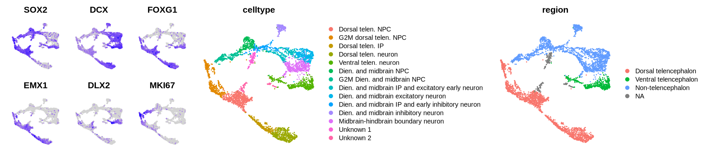
    


SOX2: neural progenitor cell marker; DCX: neuron marker; FOXG1: telencephalic NPC-neuron marker; EMX1: dorsal telencephalic (cortical) NPC-neuron marker; DLX2: ventral telencephalic (subcortical) NPC-neuron marker; MKI67: G2M phase marker

*P.S.* The `options(repr.plot.width=18, repr.plot.height=4)` command is to set the plotting area in Jpyuter notebook. If you are using other ways to run R (e.g. Rstudio), you can ignore this command

# (R) Diffusion map and diffusion pseudotime

First, let's exclude cells with unknown cell type annotation


```python
seurat <- subset(seurat, subset = celltype %in% setdiff(levels(seurat$celltype), c('Unknown 1','Unknown 2')))
seurat <- RunPCA(seurat, npcs=20)
```

    PC_ 1 
    Positive:  VIM, SOX2, ZFP36L1, RPS6, HES1, GNG5, FGFBP3, TTYH1, RPS7, RPS20 
    	   NAP1L1, RPLP1, KIAA0101, EEF1D, RPS17, RPS27L, RPS15A, SOX3, H2AFV, MAD2L1 
    	   RPS15, GSTP1, PBK, PTTG1, FABP7, RPS3, HMGN2, BTG3, C1orf61, PHGDH 
    Negative:  STMN2, RTN1, HMP19, DCX, MAPT, MLLT11, GAP43, GPM6A, RAB3A, RBFOX2 
    	   PCSK1N, TMSB10, SEZ6L2, SOX4, CRMP1, INA, TUBB2A, VAMP2, CELF4, NSG1 
    	   APLP1, BEX1, CD24, UCHL1, TUBA1A, TTC9B, SCG3, NRXN1, SCG5, CAMK2N1 
    PC_ 2 
    Positive:  RPL6, RPS27, RPS15A, RPLP0, RPS3A, RPL41, RPS19, RPL27A, RPS3, RPL30 
    	   RPL23, RPS16, RPS15, RPL31, RPL13, RPS24, RPL18A, RPS12, RPS7, RPLP2 
    	   RPS20, BTG1, ZFAS1, RPL7A, RPL36, RPS17, RPS18, RPL12, RPLP1, TPT1 
    Negative:  CCNA2, PLK1, ASPM, SGOL2, CCNB1, PBK, PRC1, CDKN3, SGOL1, MXD3 
    	   PIF1, UBE2T, KIFC1, FAM83D, KIF20A, PTTG1, KNSTRN, RACGAP1, MIS18BP1, UBE2S 
    	   MAD2L1, TROAP, KIF4A, CEP55, CASC5, KIF22, DEPDC1, NCAPG, KIF14, ARL6IP1 
    PC_ 3 
    Positive:  NFIB, FOXG1, LINC01551, NFIA, FEZF2, NEUROD2, NEUROD6, TSPO, SOX5, C1orf61 
    	   CNTNAP2, TBR1, HEY1, EMX1, MAP1LC3A, BCL11B, RPS2, LY6E, ACAT2, SLC17A7 
    	   IGFBP5, RPS18, EFNB2, SLA, EEF1B2, ABRACL, SFRP1, PTPRZ1, BCL11A, PDE1A 
    Negative:  BTG1, CRNDE, POU3F2, MAB21L1, PBX3, LHX1, LHX5, CXXC4, PTMS, IRX3 
    	   NOVA1, LHX5.AS1, TUBA1C, PPP1R1A, ARL6IP1, ZIC1, MYL6, NR2F2, EBF1, MEST 
    	   TAGLN3, RP11.445F12.1, TFAP2B, IRX5, TROAP, MAB21L2, ZFHX3, ARL4A, OTX2, AP1S2 
    PC_ 4 
    Positive:  NHLH1, NEUROD6, SOX11, GADD45G, NEUROD2, NFIB, NEUROD1, KLHL35, NEUROG2, SOX4 
    	   RASL11B, HES6, INSM1, NFIA, ZBTB18, DCC, TAC3, SSTR2, RCOR2, TCF4 
    	   GSE1, HNRNPA1, ST18, ARL4D, TBR1, ELAVL3, GADD45A, EOMES, MFNG, BHLHE22 
    Negative:  PLP1, TTYH1, HES4, NTRK2, CLU, DKK3, FGFBP3, TXNIP, SPARC, SST 
    	   PTN, EDNRB, SIX3, CXCR4, LRRC4C, DUT, RBFOX1, ID4, CALY, MGST1 
    	   ENPP2, SOX2, PEA15, SCG2, NEFL, NAP1L3, ZFHX4, FRZB, ZFP36L1, LY6H 
    PC_ 5 
    Positive:  SFRP1, EMX2, AMBN, LHX2, ZFHX4, MEIS2, STXBP6, B3GAT2, LINC01551, CREB5 
    	   ARX, OLFM3, SYNE2, DMRTA2, HMGA2, PAX6, PRKCB, GAD1, IFI44L, SLC32A1 
    	   GAD2, DOK5, CDCA7L, JADE1, DLX5, ADAMTS9, TFAP2C, MT.ND1, DLX2, DLX6.AS1 
    Negative:  ID2, EDNRB, NTRK2, ENPP2, CRNDE, PDE1A, PAX3, ZEB2, NEUROD2, CTGF 
    	   ZIC1, FRZB, MGST1, CSRP2, DYNLL1, S100A13, NEUROD6, CXCR4, GYPC, WNT7B 
    	   RFX4, GPM6B, NELL2, ZBTB18, FZD10, TBR1, EFCC1, S100A16, ARL4A, PCDH18 
    
    Warning message:
    "DimReduc pca changing from DimReduc to DimReduc"
    Warning message:
    "Number of dimensions changing from 50 to 20"
    Warning message:
    "Command RunPCA.RNA changing from SeuratCommand to SeuratCommand"


Now, let's load the *destiny* package and do diffusion map and then diffusion pseudotime using the default parameters


```python
library(destiny)
dm <- DiffusionMap(Embeddings(seurat, "pca")[,1:20], k=50)
dpt <- DPT(dm)
```

We can assign the estimated diffusion pseudotime to the Seurat object for visualization


```python
seurat$dpt <- rank(dpt$dpt)
options(repr.plot.width=12, repr.plot.height=3.5)
FeaturePlot(seurat, c("dpt","SOX2","NHLH1","DCX"), ncol=4) & NoAxes() & NoLegend()
```


    
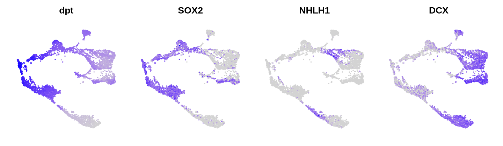
    


*P.S.* Here, it is the rank of the estimated diffusion pseudotime instead of the raw diffusion pseudotime being assigned as the final pseudotime. If you don't like that, use `seurat$dpt <- dpt$dpt` instead

As you can see above, sometimes you get an estimated pseudotime which indicates an opposite direction as the actually cell state transition (here, NPC \[SOX2+\] to neuron \[DCX\+]). This is because pseudotime represents only the distribution of cell state continuum, and the direction is based on the selected root cell. In `destiny`, there is a mechanism to 'guess' the root cell but sometimes it would guess on the opposite side of the trajectory. We can therefore restrict the root cell candidates to be only the progenitor cells 


```python
tips_cand <- sapply(1:100, function(i){ random_root(dm) })
idx_NPC <- which(seurat@meta.data$celltype %in% c('Dorsal telen. NPC',
                                                  'G2M dorsal telen. NPC',
                                                  'Dien. and midbrain NPC',
                                                  'G2M Dien. and midbrain NPC'))
tips_cand <- as.numeric(names(which.max(table(tips_cand[tips_cand %in% idx_NPC]))))
```

Now we can rerun diffusion pseudotime given the new root cell


```python
dpt2 <- DPT(dm, tips=tips_cand)
seurat$dpt2 <- rank(dpt2$dpt)

options(repr.plot.width=12, repr.plot.height=3.5)
FeaturePlot(seurat, c("dpt2","SOX2","NHLH1","DCX"), ncol=4) & NoAxes() & NoLegend()
```


    
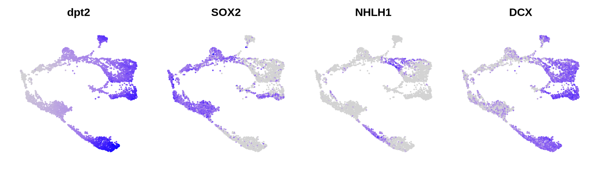
    


# (R) Use URD for trajectory analysis

## Create URD object from the Seurat object


```python
library(URD)

urd <- createURD(count.data = seurat[['RNA']]@counts, meta=seurat@meta.data, min.cells=0, min.counts=0)
urd@pca.scores <- as.data.frame(Embeddings(seurat,'pca'))
urd@tsne.y <- setNames(as.data.frame(Embeddings(seurat,'umap')), c('tSNE1','tSNE2'))
urd@dm <- dm
```

    Loading required package: ggplot2
    
    Loading required package: Matrix
    
    Registered S3 method overwritten by 'gplots':
      method         from 
      reorder.factor gdata
    
    2024-07-09 09:12:25.285482: Filtering cells by number of genes.
    
    Warning message in asMethod(object):
    "sparse->dense coercion: allocating vector of size 1.0 GiB"
    2024-07-09 09:12:33.549223: Filtering genes by number of cells.
    
    Warning message in asMethod(object):
    "sparse->dense coercion: allocating vector of size 1.0 GiB"
    2024-07-09 09:12:41.426589: Filtering genes by number of counts across entire data.
    
    Warning message in asMethod(object):
    "sparse->dense coercion: allocating vector of size 1.0 GiB"
    2024-07-09 09:12:47.792978: Filtering genes by maximum observed expression.
    
    Warning message in asMethod(object):
    "sparse->dense coercion: allocating vector of size 1.0 GiB"
    2024-07-09 09:12:54.10947: Creating URD object.
    
    2024-07-09 09:12:54.867491: Determining normalization factors.
    
    2024-07-09 09:12:58.200632: Normalizing and log-transforming the data.
    
    2024-07-09 09:13:11.823998: Finishing setup of the URD object.
    
    2024-07-09 09:13:14.549263: All done.
    


*P.S.* Normally, the first steps of running URD are running PCA and diffusion map. Since we have already done those with Seurat, we just simply assign those information directly to the URD object and skip those steps

## Perform the flood pseudotime estimation

In URD, which was originally developed for time-course data, the root cells are usually cells from the earliest time point. Since here we only have one time point one sample, let's use the already estimated diffusion pseudotime and pick cells with the lowest pseudotime as the root cells


```python
root_cells <- colnames(seurat)[order(seurat$dpt2)[1:100]]
floods <- floodPseudotime(urd, root.cells = root_cells, n=50, minimum.cells.flooded = 2, verbose=F)
urd <- floodPseudotimeProcess(urd, floods, floods.name="pseudotime")
```

    Warning message in floodPseudotimeProcess(urd, floods, floods.name = "pseudotime"):
    "Initializing @diff.data, though this should have been previously initialized by creation or importation of diffusion map."
    Warning message in floodPseudotimeProcess(urd, floods, floods.name = "pseudotime"):
    "Initializing @pseudotime, though this should have been previously initialized by creation or importation of diffusion map."


```python
p1 <- plotDim(urd, "pseudotime")
p2 <- plotDists(urd, "pseudotime", "celltype", plot.title="Pseudotime by celltype")

options(repr.plot.width=12, repr.plot.height=4)
p1  | p2
```


    
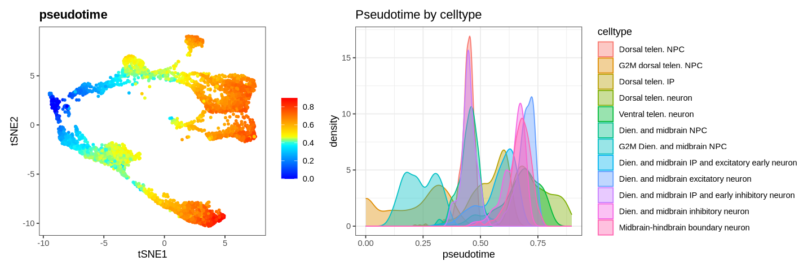
    


We can compare the flood-based pseudotime with the diffusion pseudotime


```python
seurat@meta.data$fpt <- urd@pseudotime$pseudotime
cor(seurat$fpt, seurat$dpt2, method='spearman')

options(repr.plot.width=4, repr.plot.height=4)
plot(seurat$fpt, seurat$dpt2, pch=16, col='#30303050', frame=F)
```


0.952554238155717


    
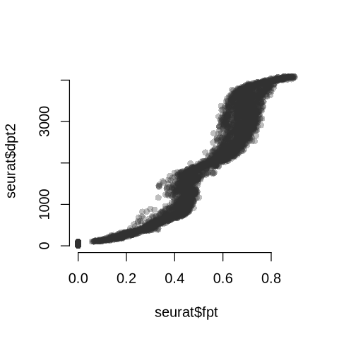
    


## Trajectory analysis

To do trajectory analysis, we need to define root cells and tip cells. For root cells, we can use the same root cells as those used for flood-pseudotime; but here, let's reassign the root cells as those with the lowest flood-based pseudotime


```python
root_cells <- rownames(urd@meta)[order(urd@pseudotime$pseudotime)[1:50]]
```

For tip cells, URD suggests to take the differentiated cell types in the latest time point. Here, let's pick neurons with the largest flood-based pseudotime of each neuron subtypes as different tips


```python
neuron_types <- setdiff(grep('neuron', levels(seurat$celltype), value=T), grep('early', levels(seurat$celltype), value=T))
idx_tips <- unlist(lapply(neuron_types, function(x){ 
  which(seurat$celltype==x)[order(seurat$fpt[seurat$celltype == x], decreasing=T)[1:50]]
}))
urd@group.ids[idx_tips, 'tip.clusters'] <- as.numeric(droplevels(seurat$celltype[idx_tips]))
```

Next, we can generate the transition matrix and perform random walk from tips to root. This step takes some a while as it performs many times of actual random walk simulation


```python
ptlogistic <- pseudotimeDetermineLogistic(urd, "pseudotime", optimal.cells.forward=20, max.cells.back=20, do.plot = F)
biased.tm <- as.matrix(pseudotimeWeightTransitionMatrix(urd, "pseudotime", logistic.params=ptlogistic))
walks <- simulateRandomWalksFromTips(urd, tip.group.id = "tip.clusters", root.cells = root_cells, transition.matrix = biased.tm,
                                     n.per.tip = 5000, root.visits = 1, max.steps = 4000, verbose = F)
urd <- processRandomWalksFromTips(urd, walks, verbose = F)
```

    [1] "Mean pseudotime back (~20 cells) 0.00434448893005983"
    [1] "Chance of accepted move to equal pseudotime is 0.5"
    [1] "Mean pseudotime forward (~20 cells) -0.00434448893005983"


    
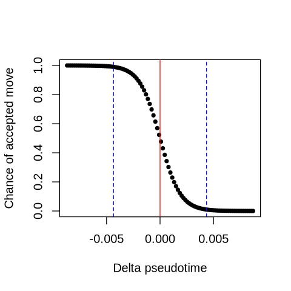
    


Now, we can build the trajectory tree and visualize it


```python
tree <- loadTipCells(urd, "tip.clusters")
tree <- buildTree(tree, pseudotime = "pseudotime", tips.use=NULL, divergence.method = "preference", cells.per.pseudotime.bin = 25, bins.per.pseudotime.window = 8, save.all.breakpoint.info = T, p.thresh=0.001)
tree <- nameSegments(tree,
                     segments= sort(unique(tree@group.ids$tip.clusters)),
                     segment.names = levels(droplevels(seurat$celltype[idx_tips])),
                     short.names = c('dTN','vTN','DMExN','DMInN','MHBN'))
```

    Tips not provided, so using: 1, 2, 3, 4, 5
    


    [1] "Calculating divergence between 1 and 2 (Pseudotime 0 to 0.814)"
    [1] "Calculating divergence between 1 and 3 (Pseudotime 0 to 0.761)"
    [1] "Calculating divergence between 1 and 4 (Pseudotime 0 to 0.721)"
    [1] "Calculating divergence between 1 and 5 (Pseudotime 0 to 0.768)"
    [1] "Calculating divergence between 2 and 3 (Pseudotime 0 to 0.761)"
    [1] "Calculating divergence between 2 and 4 (Pseudotime 0 to 0.721)"
    [1] "Calculating divergence between 2 and 5 (Pseudotime 0 to 0.768)"
    [1] "Calculating divergence between 3 and 4 (Pseudotime 0 to 0.721)"
    [1] "Calculating divergence between 3 and 5 (Pseudotime 0 to 0.761)"
    [1] "Calculating divergence between 4 and 5 (Pseudotime 0 to 0.721)"
    [1] "Joining segments 3 and 5 at pseudotime 0.623 to create segment 6"
    [1] "Calculating divergence between 1 and 6 (Pseudotime 0 to 0.623)"
    [1] "Calculating divergence between 2 and 6 (Pseudotime 0 to 0.623)"
    [1] "Calculating divergence between 4 and 6 (Pseudotime 0 to 0.623)"
    [1] "Joining segments 2 and 6 at pseudotime 0.459 to create segment 7"
    [1] "Calculating divergence between 1 and 7 (Pseudotime 0 to 0.459)"


    Difference between 1 and 7 always FALSE -- setting breakpoint to end.
    


    [1] "Calculating divergence between 4 and 7 (Pseudotime 0 to 0.459)"
    [1] "Joining segments 1 and 7 at pseudotime 0.458 to create segment 8"
    [1] "Calculating divergence between 4 and 8 (Pseudotime 0 to 0.458)"
    [1] "Joining segments 4 and 8 at pseudotime 0.237 to create segment 9"
    [1] "Assigning cells to segments."


    Warning message in assignCellsToSegments(object, pseudotime, verbose):
    "259 cells were not visited by a branch that exists at their pseudotime and were not assigned."


    [1] "Collapsing short segments."
    [1] "Removing singleton segments."
    [1] "Reassigning cells to segments."


    Warning message in assignCellsToSegments(object, pseudotime, verbose):
    "259 cells were not visited by a branch that exists at their pseudotime and were not assigned."


    [1] "Assigning cells to nodes."
    [1] "Laying out tree."


    Warning message:
    "Setting row names on a tibble is deprecated."


    [1] "Adding cells to tree."


```python
p1 <- plotTree(tree, "segment", title="Segments")
p2 <- plotTree(tree, "celltype", title="Cell type")
options(repr.plot.width=12, repr.plot.height=6)
p1 | p2
```


    
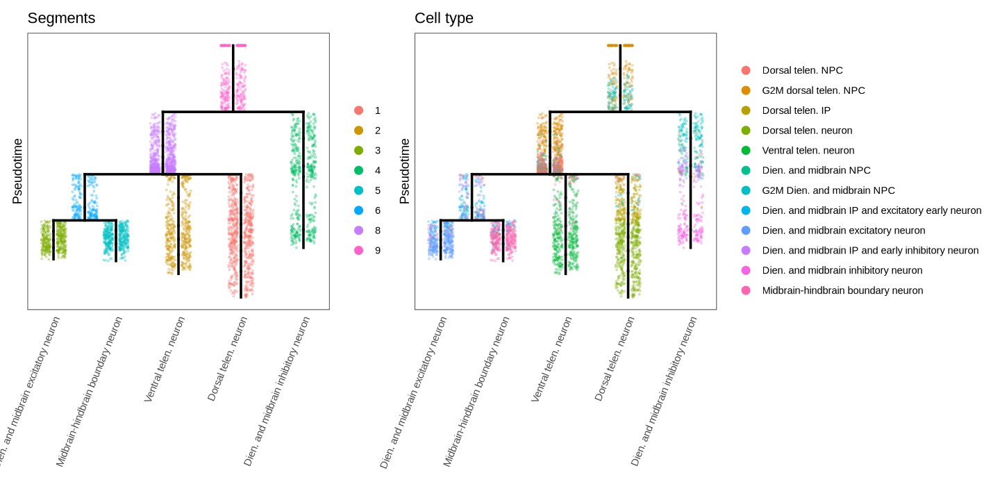
    


We can also assign the tree segments back to the Seurat object and visualize there


```python
seurat@meta.data$URD_segment <- tree@group.ids$segment
options(repr.plot.height=4, repr.plot.width=4)
UMAPPlot(seurat, group.by='URD_segment', label=T) & NoAxes() & NoLegend()
```


    
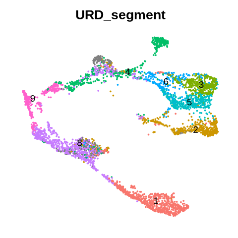
    


# (R) Convert the Seurat object to AnnData

The rest of the analysis are largely based on Python, the obviously Python doesn't know how to read a Seurat object. Therefore, we need to convert the Seurat object to an AnnData object, save it as an h5ad file, so that we can read it in Python


```python
library(anndata)
library(Matrix)

shared_genes <- intersect(rownames(seurat[['RNA']]),
                          intersect(rownames(seurat[['spliced']]),
                                    rownames(seurat[['unspliced']])))
adata <- AnnData(X = t(seurat[['RNA']]@data[shared_genes,]),
                 obs = seurat@meta.data,
                 var = seurat[['RNA']]@meta.features[shared_genes,],
                 layers = list(counts = t(seurat[['RNA']]@counts[shared_genes,]),
                               spliced = t(seurat[['spliced']]@counts[shared_genes,]),
                               unspliced = t(seurat[['unspliced']]@counts[shared_genes,])),
                 obsm = list(X_pca = Embeddings(seurat,"pca")[,1:20],
                             X_umap = Embeddings(seurat,"umap"))
                )
adata$write_h5ad("DS1.h5ad")
```

    
    Attaching package: 'anndata'
    
    
    The following object is masked from 'package:SeuratObject':
    
        Layers
    
    


    None


*P.S.* SeuratDisk (https://github.com/mojaveazure/seurat-disk) also provides the Seurat to h5ad conversion functionality. However, it designs to work for only one Assay, for which it converts the "data" slot/layer of the Array into the "X" slot of the AnnData, and the "counts" slot/layer into a matrix in the "layers" slot of the AnnData. This doesn't work for what we want to do here

*P.S.* In an AnnData object, it is required that all data matrices (X and all matrices in the "layer" slot) share the same dimensionalities. As we have also the spliced and unspliced assays in the Seurat object and we want to include them as distinct layers in the AnnData for the scVelo analysis, we have to subset into genes appear in all the three matrices.

# (Python) Diffusion map and diffusion pseudotime in Python

In Python, the standard scRNA-seq analysis package `scanpy` has the implementation to run diffusion map and diffusion pseudotime. Now, let's load the AnnData object and run diffusion map with `scanpy`


```python
import scanpy as sc

adata = sc.read_h5ad('DS1.h5ad')
sc.pp.neighbors(adata, n_neighbors=50, n_pcs=20, use_rep='X_pca')
sc.tl.diffmap(adata, n_comps=20)
```

*P.S.* If you fail to generate the DS1.h5ad earlier due to technical reason, you can download the file via this [link](https://polybox.ethz.ch/index.php/s/bUYZE6qPgROBggH).

In scanpy, the diffusion pseudotime (`scanpy.tl.dpt`) function requires the root cell to be manually labeled. To use the same root guessing procedure as implemented in destiny in R, we have to re-implement it with the following code:


```python
import random
import numpy as np
import pandas as pd
def random_root(adata, seed = None, neighbors_key=None, idx_subset = None):
    if seed is not None:
        random.seed(seed)
    iroot_bak = None
    if 'iroot' in adata.uns.keys():
        iroot_bak = adata.uns['iroot'].copy()
    dpt_bak = None
    if 'dpt_pseudotime' in adata.obs.columns:
        dpt_bak = adata.obs['dpt_pseudotime'].copy()
    
    idx = np.random.choice(list(range(adata.shape[0])))
    adata.uns['iroot'] = idx
    sc.tl.dpt(adata, neighbors_key=neighbors_key)
    dpt = adata.obs['dpt_pseudotime']
    if idx_subset is not None:
        dpt = dpt.iloc[idx_subset]
    idx_max_dpt = np.argmax(dpt)
    if idx_subset is not None:
        idx_max_dpt = idx_subset[idx_max_dpt]
    
    del adata.uns['iroot']
    del adata.obs['dpt_pseudotime']
    if iroot_bak is not None:
        adata.uns['iroot'] = iroot_bak.copy()
    if dpt_bak is not None:
        adata.obs['dpt_pseudotime'] = dpt_bak.copy()
    
    return idx_max_dpt
```

Now, we can do as before, restrict the root cell candidates to be neurons and then perform diffusion pseudotime


```python
idx_subset = np.where(np.isin(adata.obs['celltype'], ['Dorsal telen. NPC',
                                                      'G2M dorsal telen. NPC',
                                                      'Dien. and midbrain NPC',
                                                      'G2M Dien. and midbrain NPC']))[0]
idxs_rand_root = np.apply_along_axis(lambda x: random_root(adata, idx_subset=idx_subset),
                                     1, np.array(range(1000))[:,None])
adata.uns['iroot'] = np.argmax(np.bincount(idxs_rand_root))
sc.tl.dpt(adata, n_dcs=20)
```

We can compare the estimated pseudotime with the one we got with `destiny` in R. They should look very very similar


```python
from scipy.stats import pearsonr, spearmanr, rankdata
[pearsonr(adata.obs['dpt2'], adata.obs['dpt_pseudotime']),
 spearmanr(adata.obs['dpt2'], adata.obs['dpt_pseudotime'])]
```


    [PearsonRResult(statistic=0.9664124087201517, pvalue=0.0),
     SignificanceResult(statistic=0.9962742937769636, pvalue=0.0)]


```python
adata.obs['dpt_pseudotime_rank'] = rankdata(adata.obs['dpt_pseudotime'])
import matplotlib.pyplot as plt
plt.scatter(adata.obs['dpt2'], adata.obs['dpt_pseudotime_rank'])
plt.show()
```


    
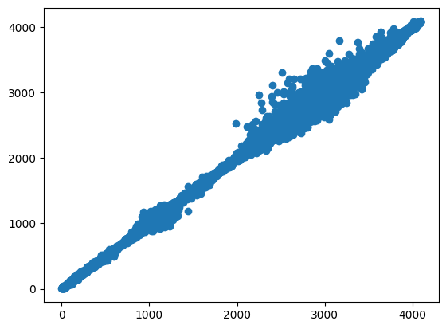
    


```python
from matplotlib.pyplot import rc_context
with rc_context({'figure.figsize':(4,4)}):
    sc.pl.umap(adata, color=['dpt2','dpt_pseudotime_rank','NES','DCX'], color_map='RdBu_r', ncols=4)
```


    
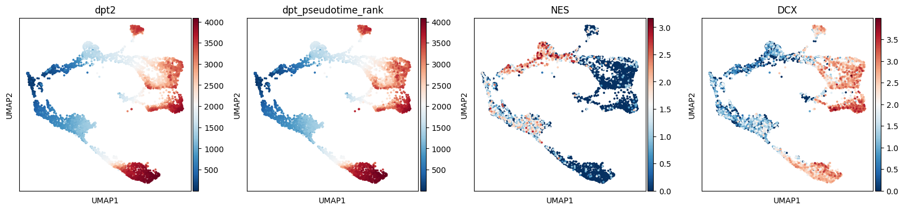
    


# (Python) Coarse-grain trajectory analysis with PAGA

The implementation of PAGA, the cluster connectivity analysis which can be seen as a coarse-grain trajectory analysis, is also included in `scanpy`. The analysis requires a cell-level neighborhood graph, which we can estimated using any dimensionality reduction result. Here, we take the diffusion map as it can be seen as a denoised neighborhood graph than the PCA-based one 


```python
adata.obs['celltype'] = adata.obs['celltype'].cat.remove_unused_categories()
sc.pp.neighbors(adata, n_neighbors=20, n_pcs=20, use_rep='X_diffmap')
sc.tl.paga(adata, groups='celltype')
```


```python
sc.pl.paga(adata)
```


    
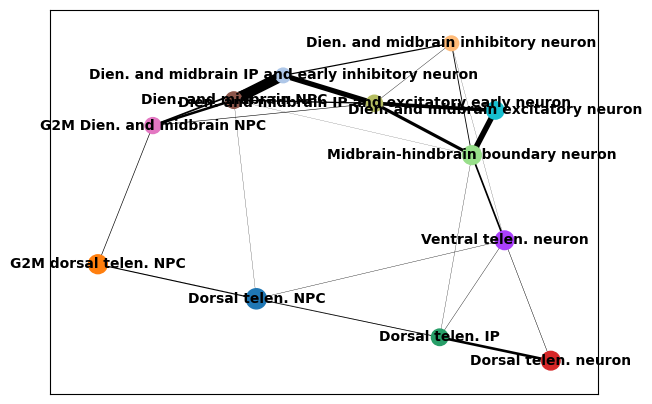
    


We can also print out the cluster pairs with their inter-cluster connectivity over a certain threshold (here, 0.1)


```python
from scipy import sparse
connected = adata.uns['paga']['connectivities'] > 0.1
connected = (connected + connected.T) > 0
idx_row, idx_col, dat = sparse.find(connected)
idx = (idx_row >= idx_col)
connected_celltypes = pd.DataFrame({ 'node1' : adata.obs['celltype'].cat.categories[idx_row[idx]],
                                     'node2' : adata.obs['celltype'].cat.categories[idx_col[idx]]})
connected_celltypes
```


<div>
<style scoped>
    .dataframe tbody tr th:only-of-type {
        vertical-align: middle;
    }

    .dataframe tbody tr th {
        vertical-align: top;
    }

    .dataframe thead th {
        text-align: right;
    }
</style>
<table border="1" class="dataframe">
  <thead>
    <tr style="text-align: right;">
      <th></th>
      <th>node1</th>
      <th>node2</th>
    </tr>
  </thead>
  <tbody>
    <tr>
      <th>0</th>
      <td>G2M dorsal telen. NPC</td>
      <td>Dorsal telen. NPC</td>
    </tr>
    <tr>
      <th>1</th>
      <td>Dorsal telen. neuron</td>
      <td>Dorsal telen. IP</td>
    </tr>
    <tr>
      <th>2</th>
      <td>G2M Dien. and midbrain NPC</td>
      <td>Dien. and midbrain NPC</td>
    </tr>
    <tr>
      <th>3</th>
      <td>Dien. and midbrain IP and excitatory early neuron</td>
      <td>Dien. and midbrain NPC</td>
    </tr>
    <tr>
      <th>4</th>
      <td>Dien. and midbrain excitatory neuron</td>
      <td>Dien. and midbrain IP and excitatory early neuron</td>
    </tr>
    <tr>
      <th>5</th>
      <td>Dien. and midbrain IP and early inhibitory neuron</td>
      <td>Dien. and midbrain NPC</td>
    </tr>
    <tr>
      <th>6</th>
      <td>Dien. and midbrain IP and early inhibitory neuron</td>
      <td>G2M Dien. and midbrain NPC</td>
    </tr>
    <tr>
      <th>7</th>
      <td>Dien. and midbrain IP and early inhibitory neuron</td>
      <td>Dien. and midbrain IP and excitatory early neuron</td>
    </tr>
    <tr>
      <th>8</th>
      <td>Dien. and midbrain inhibitory neuron</td>
      <td>Dien. and midbrain IP and early inhibitory neuron</td>
    </tr>
    <tr>
      <th>9</th>
      <td>Midbrain-hindbrain boundary neuron</td>
      <td>Ventral telen. neuron</td>
    </tr>
    <tr>
      <th>10</th>
      <td>Midbrain-hindbrain boundary neuron</td>
      <td>Dien. and midbrain IP and excitatory early neuron</td>
    </tr>
    <tr>
      <th>11</th>
      <td>Midbrain-hindbrain boundary neuron</td>
      <td>Dien. and midbrain excitatory neuron</td>
    </tr>
  </tbody>
</table>
</div>


# (Python) scVelo analysis

Next, we run scVelo for the RNA velocity analysis. It expects the input AnnData object contains two layers, one called 'spliced' for the spliced transcript count matrix, and the other called 'unspliced' for the unspliced transcript count matrix. Here we don't need to worry about it because when converting the data to AnnData, we have already addressed this issue.

However, if you don't yet have these two matrices, you have to generate them first and include them in the AnnData object. There are different tools to obtain those two matrices. One example is the command line interface of `velocyto`, as mentioned in their [documentation](https://velocyto.org/velocyto.py/tutorial/cli.html). The output of `velocyto` is a `loom` file, which can be read into R with `loomR` or into Python with `loompy`. Another example is [dropEst](https://github.com/kharchenkolab/dropEst), which can generate an RDS file. By loading the file into R, you can get a list with the matrices.

The first steps of scVelo is 1) basic preprocessing (gene selection and normalization), and 2) computing the first- and second-order moments (means and uncentered variances) for velocity estimation


```python
import scvelo as scv

adata.raw = adata
scv.pp.filter_and_normalize(adata,
                            min_shared_counts=10,
                            n_top_genes=3000)
sc.pp.neighbors(adata, use_rep='X_pca')
scv.pp.moments(adata, n_neighbors = None)
```

    Filtered out 5114 genes that are detected 10 counts (shared).
    WARNING: Did not normalize X as it looks processed already. To enforce normalization, set `enforce=True`.
    Normalized count data: spliced, unspliced.


    /links/groups/treutlein/USERS/zhisong_he/miniconda3/envs/env_scg2/lib/python3.9/site-packages/pandas/core/dtypes/cast.py:1641: DeprecationWarning: np.find_common_type is deprecated.  Please use `np.result_type` or `np.promote_types`.
    See https://numpy.org/devdocs/release/1.25.0-notes.html and the docs for more information.  (Deprecated NumPy 1.25)
      return np.find_common_type(types, [])
    /links/groups/treutlein/USERS/zhisong_he/miniconda3/envs/env_scg2/lib/python3.9/site-packages/pandas/core/algorithms.py:522: DeprecationWarning: np.find_common_type is deprecated.  Please use `np.result_type` or `np.promote_types`.
    See https://numpy.org/devdocs/release/1.25.0-notes.html and the docs for more information.  (Deprecated NumPy 1.25)
      common = np.find_common_type([values.dtype, comps_array.dtype], [])
    /links/groups/treutlein/USERS/zhisong_he/miniconda3/envs/env_scg2/lib/python3.9/site-packages/pandas/core/algorithms.py:522: DeprecationWarning: np.find_common_type is deprecated.  Please use `np.result_type` or `np.promote_types`.
    See https://numpy.org/devdocs/release/1.25.0-notes.html and the docs for more information.  (Deprecated NumPy 1.25)
      common = np.find_common_type([values.dtype, comps_array.dtype], [])


    Extracted 3000 highly variable genes.
    Logarithmized X.


    /links/groups/treutlein/USERS/zhisong_he/miniconda3/envs/env_scg2/lib/python3.9/site-packages/scvelo/preprocessing/utils.py:705: DeprecationWarning: `log1p` is deprecated since scVelo v0.3.0 and will be removed in a future version. Please use `log1p` from `scanpy.pp` instead.
      log1p(adata)


    computing moments based on connectivities
        finished (0:00:01) --> added 
        'Ms' and 'Mu', moments of un/spliced abundances (adata.layers)


Next, we perform the velocity analysis using the 'stochastic' mode.


```python
scv.tl.velocity(adata, mode='stochastic')
scv.tl.velocity_graph(adata)
```

    computing velocities


    /links/groups/treutlein/USERS/zhisong_he/miniconda3/envs/env_scg2/lib/python3.9/site-packages/scvelo/tools/optimization.py:184: DeprecationWarning: Conversion of an array with ndim > 0 to a scalar is deprecated, and will error in future. Ensure you extract a single element from your array before performing this operation. (Deprecated NumPy 1.25.)
      gamma[i] = np.linalg.pinv(A.T.dot(A)).dot(A.T.dot(y[:, i]))


        finished (0:00:02) --> added 
        'velocity', velocity vectors for each individual cell (adata.layers)
    computing velocity graph (using 1/144 cores)


      0%|          | 0/4093 [00:00<?, ?cells/s]


        finished (0:00:11) --> added 
        'velocity_graph', sparse matrix with cosine correlations (adata.uns)


*P.S.* Maybe you would want to try the other two modes as well? They are 'deterministic' and 'dynamical'. If you want to use the 'dynamical' mode, you should firstly run `scv.tl.recover_dynamics(adata)`, which is pretty slow.

Now, we can visualize the estimated velocity result


```python
import matplotlib.pyplot as plt
fig, ax = plt.subplots(1,3,figsize=(12,4))
scv.pl.velocity_embedding_stream(adata, ax=ax[0], basis="umap", color="celltype", frameon=False, show=False)
scv.pl.velocity_embedding_grid(adata, ax=ax[1], basis="umap", color="celltype", frameon=False, arrow_size=2, arrow_length=2, show=False)
scv.pl.velocity_embedding (adata, ax=ax[2], basis="umap", color="celltype", frameon=False, arrow_size=2, arrow_length=2, show=False)
fig.show()
```

    /links/groups/treutlein/USERS/zhisong_he/miniconda3/envs/env_scg2/lib/python3.9/site-packages/pandas/core/algorithms.py:522: DeprecationWarning: np.find_common_type is deprecated.  Please use `np.result_type` or `np.promote_types`.
    See https://numpy.org/devdocs/release/1.25.0-notes.html and the docs for more information.  (Deprecated NumPy 1.25)
      common = np.find_common_type([values.dtype, comps_array.dtype], [])
    /links/groups/treutlein/USERS/zhisong_he/miniconda3/envs/env_scg2/lib/python3.9/site-packages/pandas/core/algorithms.py:522: DeprecationWarning: np.find_common_type is deprecated.  Please use `np.result_type` or `np.promote_types`.
    See https://numpy.org/devdocs/release/1.25.0-notes.html and the docs for more information.  (Deprecated NumPy 1.25)
      common = np.find_common_type([values.dtype, comps_array.dtype], [])
    /links/groups/treutlein/USERS/zhisong_he/miniconda3/envs/env_scg2/lib/python3.9/site-packages/pandas/core/algorithms.py:522: DeprecationWarning: np.find_common_type is deprecated.  Please use `np.result_type` or `np.promote_types`.
    See https://numpy.org/devdocs/release/1.25.0-notes.html and the docs for more information.  (Deprecated NumPy 1.25)
      common = np.find_common_type([values.dtype, comps_array.dtype], [])


    
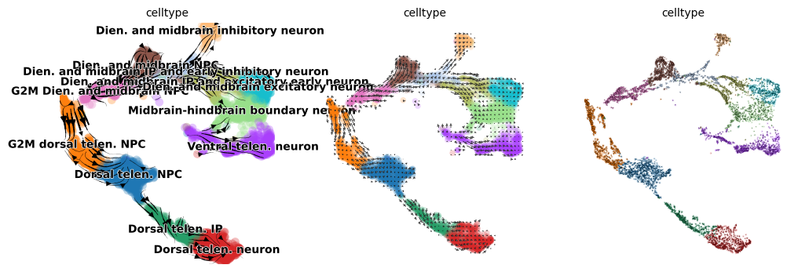
    


Based on the velocity transition matrix, one can also estimate a pseudotime


```python
scv.tl.velocity_pseudotime(adata)
```

    computing terminal states
        identified 3 regions of root cells and 4 regions of end points .
        finished (0:00:00) --> added
        'root_cells', root cells of Markov diffusion process (adata.obs)
        'end_points', end points of Markov diffusion process (adata.obs)


```python
with rc_context({'figure.figsize':(4,4)}):
    sc.pl.umap(adata, color=['dpt2','fpt','dpt_pseudotime_rank','velocity_pseudotime'], cmap='RdBu_r', frameon=False, ncols=4)
```


    
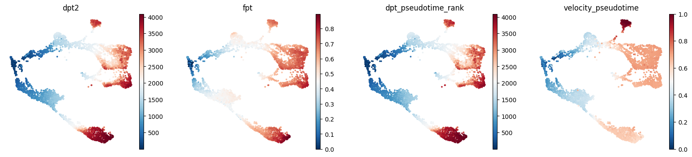
    


# (Python) Fate probability estimation with CellRank 2

Last but not the least, we can run CellRank by incorporating different information: transcriptomic similarity, pseudotime, and velocity


```python
import cellrank as cr

pk = cr.kernels.PseudotimeKernel(adata, time_key="dpt_pseudotime").compute_transition_matrix()
ck = cr.kernels.ConnectivityKernel(adata).compute_transition_matrix()
vk = cr.kernels.VelocityKernel(adata).compute_transition_matrix()
combined_kernel = 0.5 * vk + 0.3 * pk + 0.2 * ck
```

    /links/groups/treutlein/USERS/zhisong_he/miniconda3/envs/env_scg2/lib/python3.9/site-packages/cellrank/pl/_heatmap.py:10: DeprecationWarning: Please import `convolve` from the `scipy.ndimage` namespace; the `scipy.ndimage.filters` namespace is deprecated and will be removed in SciPy 2.0.0.
      from scipy.ndimage.filters import convolve


      0%|          | 0/4093 [00:00<?, ?cell/s]


      0%|          | 0/4093 [00:00<?, ?cell/s]


      0%|          | 0/4093 [00:00<?, ?cell/s]


*P.S.* Here, the combined kernel is 50% velocity + 30% pseudotime + 20% similarity. Maybe you can try also other combinations, or to use only one information

CellRank has the functionality to infer terminal states. Let's give it a try and see what population it thinks to be terminal states


```python
g = cr.estimators.GPCCA(combined_kernel)
g.fit(n_states=15, cluster_key="celltype")
g.predict_terminal_states(method="top_n", n_states=10)
g.plot_macrostates(which="terminal")
```

    /links/groups/treutlein/USERS/zhisong_he/miniconda3/envs/env_scg2/lib/python3.9/site-packages/scvelo/plotting/scatter.py:656: UserWarning: No data for colormapping provided via 'c'. Parameters 'cmap' will be ignored
      smp = ax.scatter(
    /links/groups/treutlein/USERS/zhisong_he/miniconda3/envs/env_scg2/lib/python3.9/site-packages/scvelo/plotting/scatter.py:694: UserWarning: No data for colormapping provided via 'c'. Parameters 'cmap' will be ignored
      ax.scatter(
    /links/groups/treutlein/USERS/zhisong_he/miniconda3/envs/env_scg2/lib/python3.9/site-packages/scvelo/plotting/utils.py:1391: UserWarning: No data for colormapping provided via 'c'. Parameters 'cmap' will be ignored
      ax.scatter(x, y, s=bg_size, marker=".", c=bg_color, zorder=zord - 2, **kwargs)
    /links/groups/treutlein/USERS/zhisong_he/miniconda3/envs/env_scg2/lib/python3.9/site-packages/scvelo/plotting/utils.py:1392: UserWarning: No data for colormapping provided via 'c'. Parameters 'cmap' will be ignored
      ax.scatter(x, y, s=gp_size, marker=".", c=gp_color, zorder=zord - 1, **kwargs)
    /links/groups/treutlein/USERS/zhisong_he/miniconda3/envs/env_scg2/lib/python3.9/site-packages/pandas/core/algorithms.py:522: DeprecationWarning: np.find_common_type is deprecated.  Please use `np.result_type` or `np.promote_types`.
    See https://numpy.org/devdocs/release/1.25.0-notes.html and the docs for more information.  (Deprecated NumPy 1.25)
      common = np.find_common_type([values.dtype, comps_array.dtype], [])


    
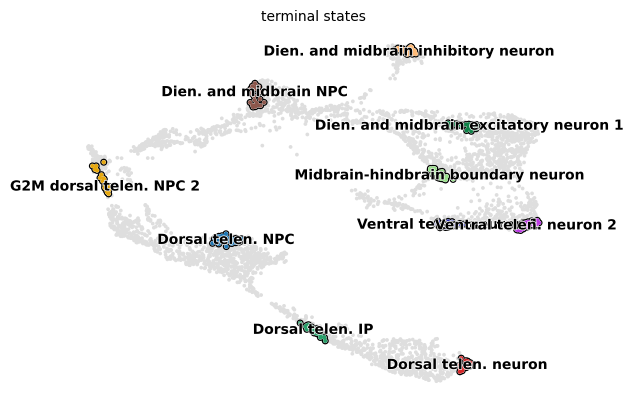
    


This functionality is very useful when you are working with an unfamiliar system, or you are interested in characterizing unknown cell states. The estimated terminal states are not necessarily correct, of course. When you are not convinced by the estimation, you can manually set the terminal states. Here, we set it to the neurons with the highest diffusion pseudotime


```python
g = cr.estimators.GPCCA(combined_kernel)
neuron_types = [ x for x in adata.obs['celltype'].cat.categories if x.endswith('neuron') and 'early' not in x ]
terminal_states = [adata[adata.obs['celltype']==x,:].obs['dpt_pseudotime'].sort_values(ascending=False)[:30].index for x in neuron_types]
terminal_states = dict(zip(neuron_types, terminal_states))
g.set_terminal_states(terminal_states)
g.plot_macrostates(which="terminal")
```

    /links/groups/treutlein/USERS/zhisong_he/miniconda3/envs/env_scg2/lib/python3.9/site-packages/scvelo/plotting/scatter.py:656: UserWarning: No data for colormapping provided via 'c'. Parameters 'cmap' will be ignored
      smp = ax.scatter(
    /links/groups/treutlein/USERS/zhisong_he/miniconda3/envs/env_scg2/lib/python3.9/site-packages/scvelo/plotting/scatter.py:694: UserWarning: No data for colormapping provided via 'c'. Parameters 'cmap' will be ignored
      ax.scatter(
    /links/groups/treutlein/USERS/zhisong_he/miniconda3/envs/env_scg2/lib/python3.9/site-packages/scvelo/plotting/utils.py:1391: UserWarning: No data for colormapping provided via 'c'. Parameters 'cmap' will be ignored
      ax.scatter(x, y, s=bg_size, marker=".", c=bg_color, zorder=zord - 2, **kwargs)
    /links/groups/treutlein/USERS/zhisong_he/miniconda3/envs/env_scg2/lib/python3.9/site-packages/scvelo/plotting/utils.py:1392: UserWarning: No data for colormapping provided via 'c'. Parameters 'cmap' will be ignored
      ax.scatter(x, y, s=gp_size, marker=".", c=gp_color, zorder=zord - 1, **kwargs)
    /links/groups/treutlein/USERS/zhisong_he/miniconda3/envs/env_scg2/lib/python3.9/site-packages/pandas/core/algorithms.py:522: DeprecationWarning: np.find_common_type is deprecated.  Please use `np.result_type` or `np.promote_types`.
    See https://numpy.org/devdocs/release/1.25.0-notes.html and the docs for more information.  (Deprecated NumPy 1.25)
      common = np.find_common_type([values.dtype, comps_array.dtype], [])


    
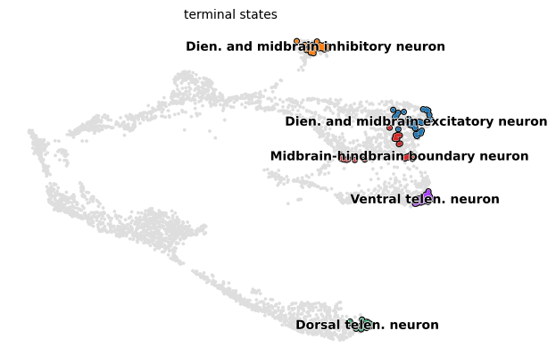
    


Now it's time to compute the fate probabilities


```python
g.compute_fate_probabilities()
```


      0%|          | 0/5 [00:00<?, ?/s]


```python
with rc_context({'figure.figsize':(4,4)}):
    g.plot_fate_probabilities(legend_loc="right", basis='X_umap', same_plot=False)
```


    
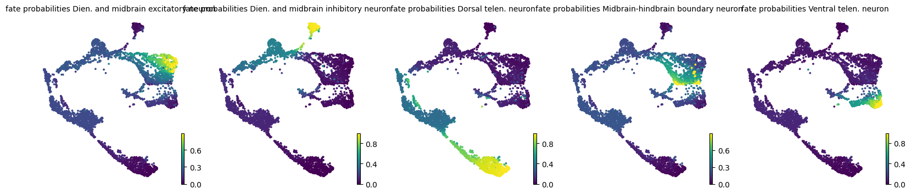
    


We can extract the estimated probabilities into a data frame, and concatenate it with the metadata


```python
prob = pd.DataFrame(g.fate_probabilities).set_index(g.terminal_states.index).set_axis(g.terminal_states.cat.categories, axis=1)
prob.head()
```


<div>
<style scoped>
    .dataframe tbody tr th:only-of-type {
        vertical-align: middle;
    }

    .dataframe tbody tr th {
        vertical-align: top;
    }

    .dataframe thead th {
        text-align: right;
    }
</style>
<table border="1" class="dataframe">
  <thead>
    <tr style="text-align: right;">
      <th></th>
      <th>Dien. and midbrain excitatory neuron</th>
      <th>Dien. and midbrain inhibitory neuron</th>
      <th>Dorsal telen. neuron</th>
      <th>Midbrain-hindbrain boundary neuron</th>
      <th>Ventral telen. neuron</th>
    </tr>
  </thead>
  <tbody>
    <tr>
      <th>AAACCTGAGAATGTTG-1</th>
      <td>0.225667</td>
      <td>0.306394</td>
      <td>0.189241</td>
      <td>0.213621</td>
      <td>0.065077</td>
    </tr>
    <tr>
      <th>AAACCTGAGAGCCTAG-1</th>
      <td>0.232062</td>
      <td>0.308843</td>
      <td>0.174309</td>
      <td>0.220828</td>
      <td>0.063958</td>
    </tr>
    <tr>
      <th>AAACCTGAGTAATCCC-1</th>
      <td>0.303332</td>
      <td>0.060361</td>
      <td>0.063318</td>
      <td>0.485697</td>
      <td>0.087292</td>
    </tr>
    <tr>
      <th>AAACCTGCACACTGCG-1</th>
      <td>0.079408</td>
      <td>0.016010</td>
      <td>0.019615</td>
      <td>0.859560</td>
      <td>0.025407</td>
    </tr>
    <tr>
      <th>AAACCTGCATCGGAAG-1</th>
      <td>0.061293</td>
      <td>0.032064</td>
      <td>0.804886</td>
      <td>0.066057</td>
      <td>0.035701</td>
    </tr>
  </tbody>
</table>
</div>


```python
adata.obs = pd.concat([adata.obs, prob.set_axis(['CR_'+x for x in prob.columns], axis=1)], axis=1)
```

# (Python) Save the AnnData


```python
adata.write_h5ad('DS1_processed.h5ad')
```


```python

```
